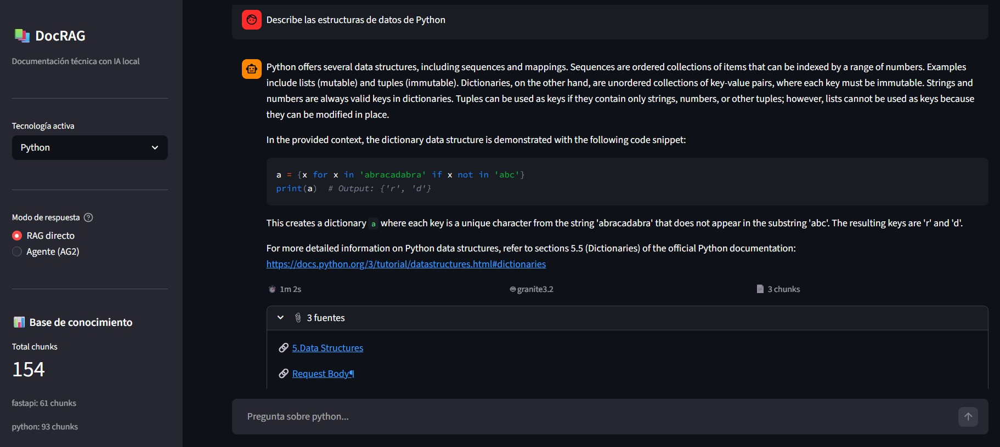
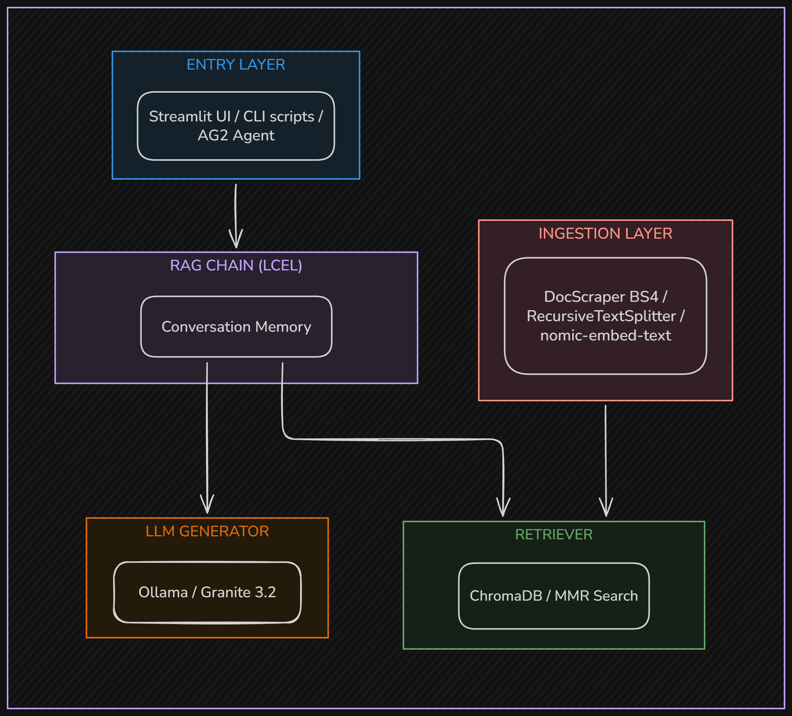

# DocuRAG

# DocuRAG

> Conversational assistant that answers technical questions using official documentation as its only source of knowledge, running fully local, for free.


---

## What it does

DocuRAG indexes official technical documentation and lets you have a conversation with it. Instead of searching through pages of docs, you ask a question in natural language and get a precise answer with a direct link to the source.

<p align="center">
  
</p>

It works in two modes:

- **RAG direct** — your question hits ChromaDB, retrieves the most relevant chunks, and Granite 3.2 generates the answer. Fast and straightforward.
- **Agent (AG2)** — an AutoGen agent reasons about your question, decides how many documentation queries to make, and synthesizes a final response. Better for complex or multi-technology questions.

Everything runs locally. No API keys, no cloud costs, no data leaving your machine.

---

## Architecture

<p align="center">
  
</p>

### Key design decisions

| Decision | Alternative considered | Reason |
|---|---|---|
| ChromaDB local | Pinecone, Weaviate | Zero cost, zero network, trivial setup |
| Ollama + Granite 3.2 | OpenAI GPT-4 | 100% local, free, private |
| nomic-embed-text | OpenAI embeddings | Free, competitive quality |
| LangChain LCEL | Custom chain | Composability, mature ecosystem |
| AG2 for agents | LangChain Agents | More expressive for multi-agent patterns |
| MMR retrieval | Cosine similarity only | Balances relevance with diversity |

---

## Stack

| Component | Technology | Version |
|---|---|---|
| Language | Python | 3.10+ |
| RAG framework | LangChain | 0.3+ |
| Vector DB | ChromaDB | 0.5.23 |
| LLM (local) | Ollama + Granite 3.2 | 0.4.7 |
| Embeddings | nomic-embed-text | latest |
| Agents | AG2 (AutoGen 2) | 0.9.0 |
| Web scraping | BeautifulSoup4 | 4.12.3 |
| UI | Streamlit | 1.35+ |
| Config | python-dotenv + PyYAML | — |
| Logging | Loguru | 0.7.3 |

---

## Getting started

### Prerequisites

- Python 3.10+
- [Ollama](https://ollama.com/download) installed and running

### 1. Clone and set up the environment

```bash
git clone https://github.com/jonuar/DocuRAG.git
cd DocuRAG

python -m venv venv
venv\Scripts\activate        # Windows
# source venv/bin/activate   # macOS / Linux

pip install -r requirements.txt
```

### 2. Pull the models

```bash
ollama pull granite3.2:latest
ollama pull nomic-embed-text
```

This downloads ~5GB total. Only needed once.

### 3. Ingest documentation

```bash
# Index FastAPI docs
python scripts/ingest.py fastapi

# Index Python docs
python scripts/ingest.py python
```

Each run scrapes the official documentation, splits it into chunks, generates embeddings, and stores them in ChromaDB under `data/chroma_db/`.

### 4. Launch the UI

```bash
streamlit run src/ui/streamlit_app.py
```

Open [http://localhost:8501](http://localhost:8501).

---

## Project structure

```
DocuRAG/
├── config/
│   ├── config.yaml          # LLM, embeddings, retrieval settings
│   ├── sources.yaml         # Documentation URLs by technology
│   └── ag2_config.yaml      # AG2 agent configuration
│
├── src/
│   ├── ingestion/
│   │   ├── scraper.py       # DocScraper with crawling support
│   │   └── pipeline.py      # Chunking, embedding, upsert to ChromaDB
│   ├── retrieval/
│   ├── generation/
│   │   └── chain.py         # LangChain LCEL RAG chain
│   ├── agents/
│   │   ├── rag_tool.py      # query_docs and list_technologies tools
│   │   └── assistant_agent.py  # AG2 agent setup and runner
│   └── ui/
│       └── streamlit_app.py
│
├── data/
│   └── chroma_db/           # Vector store (git-ignored)
│
├── scripts/
│   ├── ingest.py            # CLI ingestion
│   ├── test_rag.py          # RAG quality checks
│   └── inspect_chunks.py    # Debug chunk content
│
└── requirements.txt
```

---

## How it works

### Ingestion pipeline

1. `DocScraper` fetches each documentation URL, decodes bytes directly to handle encoding issues, and collapses syntax-highlighted code blocks into plain text before BeautifulSoup parses the DOM.
2. Navigation, footers, scripts, and header links are removed.
3. `RecursiveCharacterTextSplitter` splits the clean text into chunks of 1000 characters with 200-character overlap.
4. Each chunk gets metadata: `source_url`, `technology`, `section`, and a SHA-256 `chunk_id` for deduplication.
5. `OllamaEmbeddings` (nomic-embed-text) vectorizes each chunk and stores it in ChromaDB. Re-running ingestion skips existing chunks by ID.

### RAG chain

```
question
  → nomic-embed-text (query vector)
  → ChromaDB MMR (k=5, fetch_k=20)
  → format_docs (text + source URLs)
  → Granite 3.2 (generation)
  → answer + sources
```

MMR (Maximal Marginal Relevance) retrieves 20 candidates and selects the 5 most relevant and diverse, avoiding redundant chunks from the same section.

### Agent mode

The AG2 agent receives the question, decides which tools to call (`query_docs`, `list_technologies`), and can make multiple retrieval calls before synthesizing a final answer. This is especially useful for questions that span multiple topics or require comparing information across sections.

---

## Adding a new technology

1. Add an entry to `config/sources.yaml`:

```yaml
technologies:
  your_tech:
    name: Your Technology
    docs_urls:
      - https://docs.yourtech.io/getting-started
      - https://docs.yourtech.io/api-reference
    selectors:
      content: main   # CSS selector for the main content area
```

2. Run the ingestion:

```bash
python scripts/ingest.py your_tech
```

3. Select it from the sidebar dropdown in the UI.

---

## Known limitations

- **Encoding artifacts** — some documentation sites with mixed Latin-1/UTF-8 content may still produce minor text noise in code examples. The scraper handles the most common cases.
- **JavaScript-rendered docs** — sites that require JS execution (like some Vite or Next.js docs) are not supported. BS4 only handles static HTML.
- **First response latency** — Granite 3.2 loads into memory on the first call. Expect 30-180s on CPU. Subsequent responses are significantly faster.
- **No GPU required** — the full stack runs on CPU. A GPU will reduce latency substantially.

---

## What I implemented

- Full RAG pipeline from scratch: ingestion, chunking strategy, embedding, MMR retrieval, generation
- Why chunk quality matters more than model quality — garbage in, garbage out
- LangChain LCEL: composing chains with `RunnablePassthrough` and `|` operators
- AG2 tool registration pattern: separating `caller` and `executor` agents
- Debugging encoding issues in web scraping (apparent_encoding vs response.encoding)
- ChromaDB deduplication by content hash to support incremental ingestion

---

## Roadmap

- [ ] Hugging Face Spaces deployment with HF Inference API as LLM backend
- [ ] RAGAS evaluation suite with faithfulness and answer relevancy metrics
- [ ] Incremental ingestion with change detection
- [ ] Support for PDF and Markdown file upload
- [ ] Multi-agent Researcher pattern for cross-technology comparisons

---
